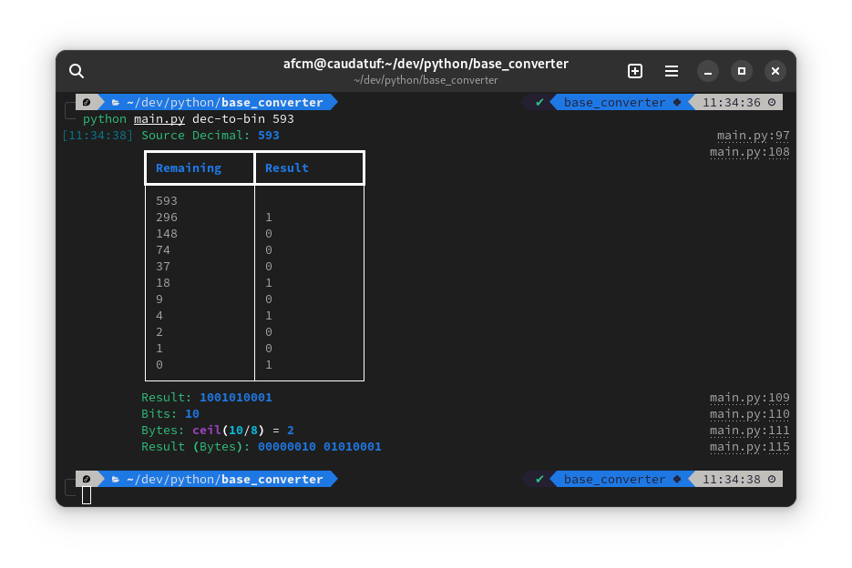
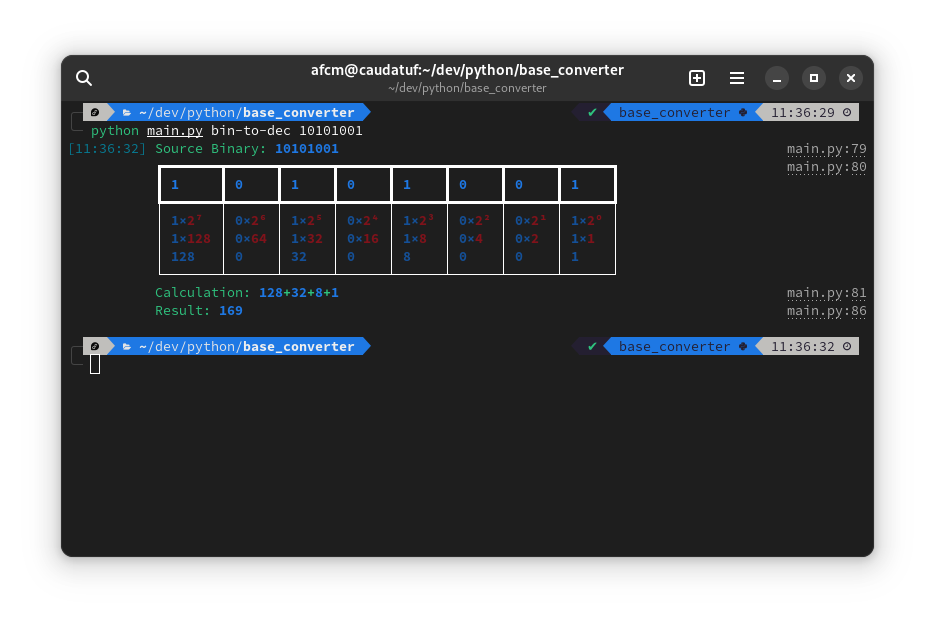

# Number Converter

## Description

This program is build with Python 3 and the [Rich](https://github.com/Textualize/rich) and [Click](https://click.palletsprojects.com) libraries.

### Binary to Decimal

### Decimal to Binary

